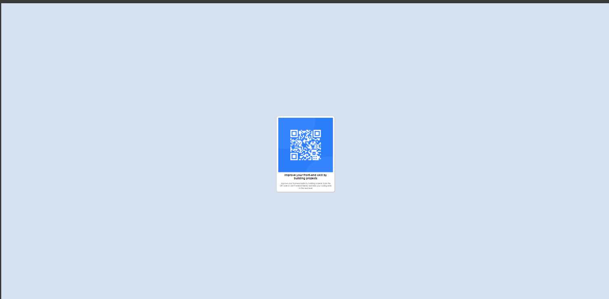

# Frontend Mentor - QR code component

## Preview.

 👋 Welcome! you to my QR Code solution page 👋

## Which Technology i used for building this project ? 
Well, For building this project i just used and apply HTML and Core CSS. 

## Deploying my project
I have deployed my project On github page - [QR code github live](https://giasuddinvuiyabd.github.io/QR-Code-Project/)